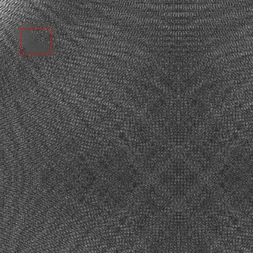
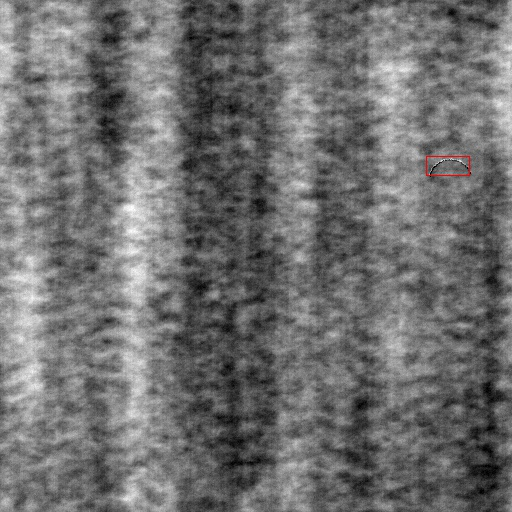

# 来源

https://github.com/msminhas93/anomaly-detection-using-autoencoders

# 特点

纹理异常检测，使用Auto-Encoder无监督训练，生成的图像与原图像形成对比后，会显现出过于锐化的异常和过于平滑的异常，适合检测花纹之类的表面是否有缺陷

# 效果

# 应用

## 1.应用场景

一些表面纹理的异常检测

## 2.输入输出

#### 输入：

{"imageId": "xxxx", "base64Data":"xxxx", "format": "jpg", "url":"xxxxx"}

#### 输出：

{"status":0, "message": "success", "result": {'delects': [[x, y, w, h]，[x,y,w,h],,,], 'target': 'yes'}}

##### x,y 指方框左上角坐标

##### w,h指方框的宽和高

##### target指是否含有缺陷，yes有，no没有

### 3.数据集

DAGM dataset：https://hci.iwr.uni-heidelberg.de/content/weakly-supervised-learning-industrial-optical-inspection     只使用无缺陷部分

